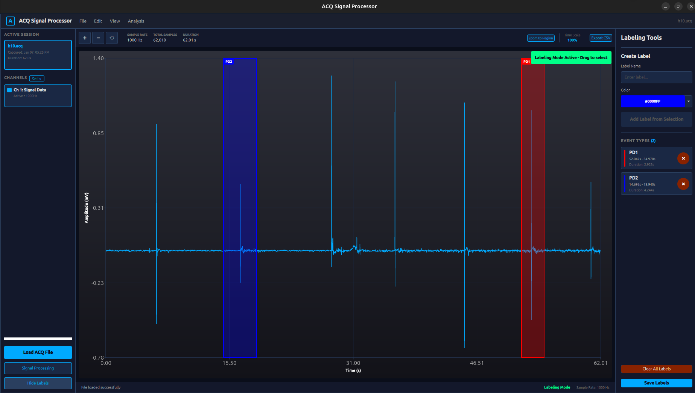

# ACQ Signal Processor

A Qt6-based desktop application for processing, filtering, and analyzing BIOPAC ACQ physiological data files. This tool provides an intuitive interface for DSP engineers to load ACQ files, apply various filters, and annotate signal segments with custom labels.



## Quick Start

1. **Build the application**:
   ```bash
   mkdir build && cd build
   cmake .. && cmake --build .
   ```

2. **Run the application**:
   ```bash
   ./build/bin/ACQProcessor
   ```

3. **Load your ACQ file**:
   - Click "Load ACQ File" button
   - Select your `.acq` file
   - Wait for conversion and loading

4. **Analyze your signal**:
   - Use **Zoom-to-Region** to inspect specific time ranges (e.g., 26.0s - 26.9s)
   - Apply **filters** to remove noise or isolate frequency bands
   - **Label** important segments for annotation and analysis
   - **Export** data as CSV or save labels as JSON

## Features
- **DSP Filtering**: Four types of Butterworth IIR filters with real-time frequency response visualization:
  - **Lowpass Filter**: Attenuate frequencies above cutoff
  - **Highpass Filter**: Attenuate frequencies below cutoff
  - **Bandpass Filter**: Pass frequencies within a specific range
  - **Notch Filter**: Attenuate specific frequencies (50/60 Hz for powerline noise)
  - **Frequency Response Chart**: Visualize filter characteristics with -3dB reference line
  - **User-defined filter order**: Input any order from 1-10 for precise control
- **Signal Labeling**: Annotate waveform segments with custom labels and colors
  - **Persistent labels**: Labels remain visible permanently until deleted
  - **Color selection**: 9 preset colors for categorizing segments
- **Data Export**:
  - **Export CSV**: Export entire waveform data as CSV (Time, Amplitude)
  - **Save Labels**: Export comprehensive label annotations to JSON format including:
    - Time information (start/end times in seconds)
    - Complete voltage data for each segment
    - Statistical analysis (min, max, average voltage)

## Prerequisites

### System Requirements
- C++ compiler with C++17 support (GCC 7+, Clang 5+, MSVC 2017+)
- CMake 3.16 or higher
- Qt 6.2 or higher with the following modules:
  - Qt Core
  - Qt GUI
  - Qt Quick
  - Qt QML
  - Qt Charts

### Python Requirements
- Python 3.7 or higher
- bioread library version 3.1.0 (critical - newer versions may have compatibility issues)

Install bioread:
```bash
pip install bioread==3.1.0
```

**Using a Virtual Environment** (Recommended):
*Window*
```bash
python3 -m venv .venv
.venv\Scripts\activate  # On Windows
pip install bioread==3.1.0
```
*Linux/MacOS*
```bash
python3 -m venv .venv
source .venv/bin/activate  # On Linux/Mac
pip install bioread==3.1.0
```
The application automatically detects and uses your active virtual environment. It supports common venv names:
- `.venv`, `venv`, `.pyvenv`, `env` (in project directory or home directory)
- Any venv activated via `source venv/bin/activate` (detected via `$VIRTUAL_ENV`)

## Building the Application

1. Clone or navigate to the project directory:
```bash
cd /path/to/ACQ_Processor
```

2. Create a build directory:
```bash
mkdir build
cd build
```

3. Configure with CMake:
```bash
cmake ..
```

4. Build the project:
```bash
cmake --build .
```

5. The executable will be in the build directory:
```bash
./ACQ_Read
```

## Project Structure

```
ACQ_Read/
├── cpp/
│   ├── inc/
│   │   ├── backend/
│   │   │   ├── DSPFilters.h           # DSP filter implementations
│   │   │   ├── ACQDataLoader.h        # ACQ data loading
│   │   │   ├── SignalProcessor.h      # Signal processing utilities
│   │   │   └── DataAnalyzer.h         # Data analysis functions
│   │   ├── controllers/
│   │   │   ├── ApplicationController.h # Main app controller
│   │   │   ├── FilterController.h      # Filter management
│   │   │   └── LabelManager.h          # Label management
│   │   └── models/
│   │       ├── ChannelData.h           # Channel data model
│   │       ├── ACQMetadata.h           # ACQ metadata model
│   │       └── SegmentLabel.h          # Label model
│   └── src/
│       ├── main.cpp                    # Application entry point
│       └── [implementation files]
├── qml/
│   ├── main.qml                        # Main window
│   ├── MainWindow.qml                  # Application layout
│   ├── WaveformView.qml                # Waveform visualization
│   ├── FilterDesignWindow.qml          # Filter design interface
│   ├── LabelingTools.qml               # Labeling tools panel
│   └── LabelOverlay.qml                # Label overlay component
├── python/
│   └── batch_acq_converter.py          # ACQ to JSON/binary converter
└── CMakeLists.txt
```

## Usage

### 1. Loading an ACQ File

1. Click the **"Load ACQ File"** button in the top toolbar
2. Select your `.acq` file from the file dialog
3. The application will:
   - Run the Python converter in the background
   - Convert ACQ data to JSON metadata + binary channel data
   - Load and display the first channel's waveform
4. Top toolbar will show:
   - **Sample Rate**: e.g., "1000 Hz"
   - **Total Samples**: e.g., "50,000"
   - **Duration**: Total recording time in seconds

### 2. Zooming and Navigation

#### Zoom-to-Region (MATLAB-style)
1. Click the **"Zoom to Region"** button in the top toolbar
2. The button will highlight in blue when active
3. Click and drag on the waveform to select a time range
   - You'll see a blue selection box with start/end timestamps (e.g., "26.000s" to "26.900s")
4. Release the mouse to zoom into that exact time range
5. Click **"Zoom to Region"** again to deactivate and return to pan mode

#### Mouse Wheel Zoom
- **Scroll Up**: Zoom in (increase time resolution)
- **Scroll Down**: Zoom out (decrease time resolution)

#### Keyboard Shortcuts
- **Ctrl + Plus (+)**: Zoom in
- **Ctrl + Minus (-)**: Zoom out
- **Ctrl + 0**: Reset zoom to fit all data

#### Panning
- Click and drag on the waveform (when not in Zoom or Label mode) to pan around
- Works in both horizontal (time) and vertical (amplitude) directions

#### Time Scale Indicator
- Shows current zoom level as a percentage (e.g., "100%" = full view, "10%" = 10x zoomed in)

### 3. Applying Signal Filters

1. Click the **"Signal Processing"** button (only enabled when data is loaded)
2. The Filter Design window opens, showing:
   - **Frequency Response Chart**: Real-time visualization of filter characteristics
   - **Filter type tabs**: Lowpass, Highpass, Bandpass, Notch
   - **Active filter indicator**: Shows current filter configuration

#### Filter Types and Parameters

**Lowpass Filter**:
- **Toggle**: ON/OFF switch to enable/disable
- **Cutoff Frequency (Hz)**: Frequencies above this are attenuated (slider: 10-1000 Hz)
- **Filter Order**: Enter value 1-10 (higher = steeper rolloff)
- Use case: Remove high-frequency noise

**Highpass Filter**:
- **Toggle**: ON/OFF switch to enable/disable
- **Cutoff Frequency (Hz)**: Frequencies below this are attenuated (slider: 1-500 Hz)
- **Filter Order**: Enter value 1-10
- Use case: Remove DC offset and low-frequency drift

**Bandpass Filter**:
- **Toggle**: ON/OFF switch to enable/disable
- **Low Cutoff (Hz)**: Lower frequency bound (slider: 1-500 Hz)
- **High Cutoff (Hz)**: Upper frequency bound (slider: 10-1000 Hz)
- **Filter Order**: Enter value 1-10
- Use case: Isolate specific frequency band (e.g., EEG alpha waves 8-12 Hz)

**Notch Filter**:
- **Toggle**: ON/OFF switch to enable/disable
- **Frequency**: Choose 50 Hz (Europe/Asia) or 60 Hz (Americas) powerline frequency
- Use case: Remove powerline interference

#### Using the Frequency Response Chart
- **Blue curve**: Shows filter magnitude response in dB
- **Red dashed line**: -3dB reference (half-power point)
- **X-axis**: Frequency from 0 Hz to Nyquist frequency (Fs/2)
- **Y-axis**: Magnitude in decibels (-60 to +5 dB)
- The chart updates in real-time as you adjust filter parameters

#### Applying Filters
1. Configure your desired filter(s) - you can enable multiple filters simultaneously
2. Watch the frequency response chart update in real-time
3. Click **"Apply Filter"** to process the signal
4. The main waveform updates with the filtered data
5. Click **"Reset Filter"** to restore original unfiltered data

**Note**:
- All cutoff frequencies must be less than the Nyquist frequency (Fs/2)
- For bandpass: Low frequency must be less than High frequency
- Filter order affects steepness: higher order = sharper cutoff but more processing

### 4. Labeling Signal Segments

#### Activating Labeling Mode
1. Click the **"Label"** button in the left sidebar
2. The labeling tools panel appears on the right side
3. A green indicator "Labeling Mode Active - Drag to select" appears on the waveform
4. Status bar shows "Labeling Mode" indicator
5. Click **"Hide Labels"** to exit labeling mode

#### Creating Labels
1. **Select a time region**:
   - Click and drag on the waveform to select a time range
   - A blue selection box appears showing the region
   - Bottom status shows: "Selected: 32.731s - 42.265s Duration: 12.534s"

2. **Configure the label**:
   - Enter a descriptive name in the "Label Name" field (right panel)
   - Choose a color from the 9 preset options (Red, Green, Blue, Yellow, etc.)
   - The color picker shows a visual preview of your selection

3. **Add the label**:
   - Click **"Add Label from Selection"** button
   - The label is added to the EVENT TYPES list
   - A colored overlay appears on the waveform showing:
     - Semi-transparent rectangle spanning the selected time range
     - Label name displayed on the overlay
     - Border in the chosen color
   - **Important**: Labels remain visible permanently, even after exiting labeling mode

#### Managing Labels

**View Labels**:
- All created labels appear in the "EVENT TYPES" section (right panel)
- Each label entry shows:
  - Label name
  - Time range (e.g., "32.731s - 42.265s")
  - Duration (e.g., "Duration: 12.534s")
  - Color-coded indicator
  - Delete button (✕)

**Delete Labels**:
- **Method 1**: Left-click on a label overlay to select it (border thickens), then press Delete or Backspace
- **Method 2**: Right-click directly on a label overlay to delete immediately
- **Method 3**: Click the ✕ button next to the label in the EVENT TYPES list
- **Clear All**: Click **"Clear All Labels"** to remove all labels at once
- 
#### Label Overlays
- Appear as semi-transparent colored rectangles on the waveform
- Show label name at the top-left corner
- Each label maintains its original color (won't change when creating new labels)
- Higher z-index ensures labels always appear above selection boxes
- Support for multiple overlapping labels

### 5. Exporting Data

#### Export Waveform as CSV
1. Click the **"Export CSV"** button in the top toolbar
2. Choose a save location and filename
3. The CSV file contains two columns:
   - **Time (s)**: Time in seconds (6 decimal precision)
   - **Amplitude (mV)**: Voltage amplitude (6 decimal precision)
4. Format example:
   ```csv
   Time (s),Amplitude (mV)
   0.000000,0.145320
   0.001000,0.152180
   0.002000,0.148560
   ```

#### Save Labels
1. Click the **"Save Labels"** button in the labeling tools panel
2. Choose a location and filename (JSON format)
3. Labels are saved with comprehensive information (see Label JSON Format section below)

## Technical Details

### DSP Filter Implementation

The application uses Butterworth IIR filters implemented as cascaded second-order sections (biquads) for numerical stability:

- **Filter Design**: Bilinear transform converts analog to digital filters
- **Frequency Normalization**: All frequencies normalized to Nyquist frequency
- **Stability**: Cascaded biquads prevent coefficient quantization errors
- **Real-time**: Filters process signals in a single pass

### ACQ Conversion Process

When loading an ACQ file:

1. Application spawns Python subprocess running `batch_acq_converter.py`
2. Python uses bioread library to parse ACQ file
3. Converter extracts:
   - Channel names and units
   - Sample rate and sample count
   - Raw sample data
4. Output format:
   - `metadata.json`: Channel information and sample rates
   - `channel_0.bin`, `channel_1.bin`, etc.: Float32 binary data per channel
5. C++ backend loads JSON metadata and binary channel data
6. First channel is displayed in waveform view

### Data Format

**JSON Metadata** (`metadata.json`):
```json
{
  "channels": [
    {
      "name": "Channel Name",
      "units": "mV",
      "sample_rate": 1000.0,
      "samples": 10000,
      "binary_file": "channel_0.bin"
    }
  ]
}
```

**Binary Files**: IEEE 754 single-precision floating-point (4 bytes per sample)

### Label JSON Format

The exported JSON file includes comprehensive information about each labeled segment:

```json
{
  "labels": [
    {
      "start_index": 1000,
      "end_index": 2000,
      "start_time": 1.0,
      "end_time": 2.0,
      "label": "Baseline",
      "color": "#FF0000",
      "voltage_data": [0.145, 0.152, 0.148, ...],
      "voltage_min": 0.135,
      "voltage_max": 0.165,
      "voltage_avg": 0.150
    },
    {
      "start_index": 3000,
      "end_index": 4500,
      "start_time": 3.0,
      "end_time": 4.5,
      "label": "Stimulus Response",
      "color": "#00FF00",
      "voltage_data": [0.245, 0.312, 0.298, ...],
      "voltage_min": 0.235,
      "voltage_max": 0.325,
      "voltage_avg": 0.275
    }
  ]
}
```

**Fields Explained**:
- `start_index` / `end_index`: Sample indices marking the segment boundaries
- `start_time` / `end_time`: Time in seconds (calculated from sample rate)
- `label`: Custom name given to the segment
- `color`: Hex color code for visualization
- `voltage_data`: Complete array of voltage values within the segment
- `voltage_min`: Minimum voltage in the segment (mV)
- `voltage_max`: Maximum voltage in the segment (mV)
- `voltage_avg`: Average voltage in the segment (mV)

## Troubleshooting

### ACQ File Loading Issues

**"No Signal" or Empty Waveform**:
- Ensure an ACQ file is loaded successfully
- Check top toolbar for sample rate and total samples
- Verify the ACQ file is not corrupted
- Try reloading the file

**Python Conversion Fails**:

*Error*: `'NoneType' object is not subscriptable`
- **Cause**: bioread version incompatibility or corrupted ACQ file
- **Solution**: Ensure bioread 3.1.0 is installed:
  ```bash
  pip install bioread==3.1.0
  ```

*Error*: `AttributeError: type object 'JournalHeader' has no attribute 'EXPECTED_TAG_VALUE_HEX'`
- **Cause**: bioread version 2025.5.2 or newer has bugs
- **Solution**: Downgrade to bioread 3.1.0:
  ```bash
  pip uninstall bioread
  pip install bioread==3.1.0
  ```

**Virtual Environment Not Detected**:
- The application checks for Python in this order:
  1. **Active venv** (via `$VIRTUAL_ENV` environment variable) - most reliable
  2. **Project directory**: `.venv`, `venv`, `.pyvenv`, `env`
  3. **Home directory**: `~/.venv`, `~/.pyvenv`
  4. **System Python**: Falls back to `python3` if no venv found
- To verify: Run the application from terminal and check for "Using virtual environment: ..." message
- If not detected: Activate your venv before running (`source venv/bin/activate`)

### Filter Issues

**Filter Not Working or Invalid Parameters**:
- All cutoff frequencies must be positive and less than Nyquist frequency (Fs/2)
- For bandpass: Low frequency must be less than High frequency
- Filter order must be between 1 and 10
- Ensure only one filter type is toggled ON at a time
- Check the frequency response chart to verify filter configuration

**Frequency Response Chart Not Updating**:
- Make sure a signal is loaded (check top toolbar indicators)
- Toggle filter switches ON/OFF to see the chart update
- Adjust sliders or change filter order to see real-time updates

### Build Errors

**Qt not found**:
- Set Qt6_DIR environment variable to Qt installation path
- Example: `export Qt6_DIR=/usr/local/Qt-6.5.0`

**nlohmann/json not found**:
- Install nlohmann-json library
- Ubuntu: `sudo apt install nlohmann-json3-dev`
- Or download single header from: https://github.com/nlohmann/json

**QML Module "QtCharts" not found**:
- Install Qt Charts module
- Ubuntu: `sudo apt install qml-module-qtcharts`
- Or ensure Qt installation includes Charts component

### Performance Tips

- Large files (>100,000 samples): Use Zoom-to-Region to work with smaller sections
- Many labels: Save frequently to avoid data loss
- Filtering large datasets: Be patient - higher order filters take longer to process
- Real-time preview: Disable if the frequency response chart causes lag

## License

This software is provided as-is for DSP engineering and research purposes.

## Repository

GitHub: [https://github.com/trietmt9/ACQ_Processor](https://github.com/trietmt9/ACQ_Processor)

## Contact

For issues, bugs, or feature requests, please submit an issue to the project repository or contact me.

## Acknowledgments

- **bioread**: Python library for reading BIOPAC ACQ files
- **Qt Framework**: Cross-platform GUI framework
- **nlohmann/json**: JSON for Modern C++
